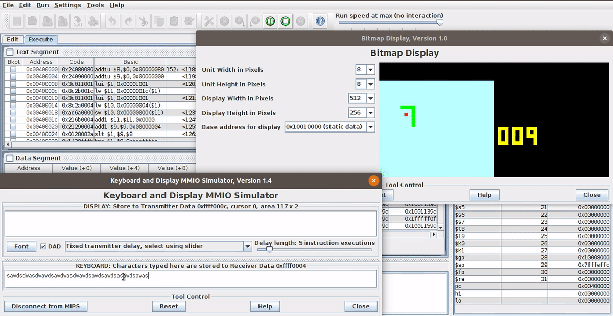
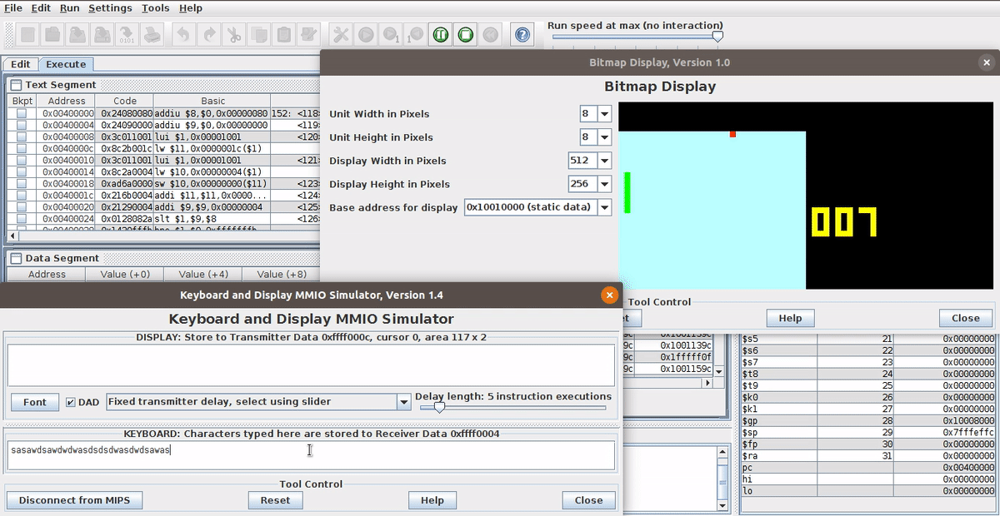

# MIPSnake :snake:

## Intro

This is a version of classic snake game for MIPS processor written in Assembly.

## How to use :apple:

To run the `.asm` file you can download a MIPS emulator. The MIPS Mars is
a free emulator made in java that you can download [here](http://courses.missouristate.edu/KenVollmar/mars/).
The actual project file is `mips_snake.asm`. Everything else in `tests` folder as its name sugests is just a bunch of tests For
handling input, generating random numbers and so on.

### MARS's bugs :bug: :exclamation: 

There's a bug in the Mars MIPS emulator. You may fix it following the instructions in this [link](https://dtconfect.wordpress.com/2013/02/09/mars-mips-simulator-lockup-hackfix/). The file `Mars_4_5_FIXED.jar` is a version of the original file with the bug corrected. 

## Running on Mars :alien:

Setting the enviroment to run the game:

It dies when hits itself...

... Or the walls.

## Authors :octocat:

|             ![Josivan][author1]           |         ![Natalia][author2]           |
|:-----------------------------------------:|:-------------------------------------:|
|[Josivan](https://github.com/JoMedeiros/)  | [Natalia](https://github.com/bnatalha)|

[author1]: https://avatars3.githubusercontent.com/u/23501167?s=180&v=4
[author2]: https://avatars1.githubusercontent.com/u/26307836?s=180&v=4

